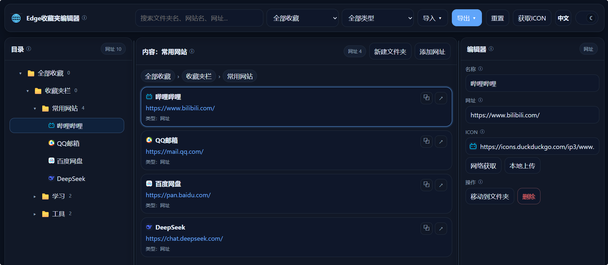

# HTML-collection

AI辅助制作的HTML项目合集

## bookmark_editor

### Github地址

[Ignorant12321/Edge-Bookmark-Editor: 一个纯静态的 Edge 收藏夹编辑器。 可直接在浏览器里打开，用来导入、整理、编辑并重新导出 Edge 的收藏夹 HTML。](https://github.com/Ignorant12321/Edge-Bookmark-Editor)

### 示例网站

[edge-bookmark-editor.pages.dev](https://edge-bookmark-editor.pages.dev/)

