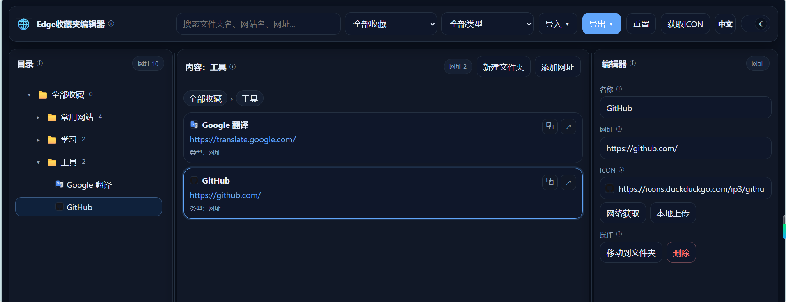

# bookmark_editor

一个纯静态的 Edge 收藏夹编辑器。

可直接在浏览器里打开，用来导入、整理、编辑并重新导出 Edge 的收藏夹 HTML。




## 功能

- 导入/导出收藏夹
- 树状目录、内容列表、编辑区联动
- 自动保存修改
- 支持书签图标查看、网络获取、本地上传
- 支持搜索、筛选、拖拽排序、移动到文件夹
- 支持中英文切换
- 支持明暗主题切换

## 打开方式

最简单的方式是直接打开 `index.html`。

如果你部署到静态站点，也可以直接把整个 `bookmark_editor` 目录作为站点根目录或子目录发布。

## 目录结构

```text
bookmark_editor/
├─ index.html
├─ README.md
└─ assets/
   ├─ css/
   │  └─ style.css
   ├─ i18n/
   │  ├─ index.js
   │  └─ locales/
   │     ├─ zh.js
   │     └─ en.js
   └─ js/
      ├─ main.js
      ├─ bootstrap.js
      ├─ actions.js
      ├─ state.js
      ├─ constants.js
      ├─ utils.js
      ├─ bookmark-format.js
      ├─ tree-model.js
      ├─ render-tree.js
      ├─ render-list.js
      └─ render-editor.js

```

## 常用操作

1. 导入收藏夹 HTML
2. 在左侧目录或中间内容区选中项目
3. 在右侧编辑区修改名称、网址或图标
4. 需要时移动到其他文件夹
5. 最后导出 HTML，再导回 Edge

## 关于导出

导出的文件名默认是：

`bookmarks_edited_时间戳.html`

## 部署

可以直接放到 Cloudflare Pages、GitHub Pages 或任意静态托管服务。

如果是 Cloudflare Pages，推荐把 `bookmark_editor` 当作发布目录。

